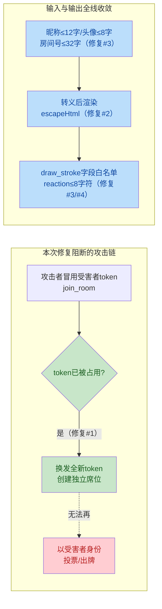

# PartyHub 全面代码审计与修复报告

> 审计日期：2026-08-28
> 审计基线：`git pull` 同步远端最新代码后（f3fc5c9 → 8dac620，含 4 个新提交）
> 审计对象：server.js（约 800 行）、12 个游戏引擎（约 3200 行）、public/game.js（约 3740 行）、index.html / style.css / Dockerfile / package.json / tests/，合计约 1.4 万行核心代码
> 验证方式：全部问题经 2 个独立验证子代理交叉复核，14/14 项以 2/2 一致确认成立后修复

---

## 一、审计概览

| 指标 | 数值 |
|------|------|
| 发现问题总数 | 14 项 + 1 项修复过程中额外发现 |
| Critical | 1 项（会话劫持） |
| Major | 6 项（XSS、输入滥用、UNO 罚牌、密码泄露、阿瓦隆卡死、设置失效） |
| Minor | 7 项 |
| 本期修复 | **15/15 全部完成** |
| 验证结果 | 语法检查 13 文件通过 · 单元测试 11/11 通过 · 服务端冒烟启动正常 |

**风险分布（修复前）**：

| 严重度 | 数量 | 编号 |
|--------|------|------|
| Critical | 1 | #1 |
| Major | 6 | #2 #3 #5 #6 #8 #12 |
| Minor | 7 | #4 #7 #9 #10 #11 #13 #14 |

---

## 二、修复后的安全链路



---

## 三、详细修复记录

### #1 【Critical】身份 token 广播 + 重复 token 席位 → 会话劫持

- **位置**：[server.js](server.js) `join_room`（约 L147-245）
- **问题**：`broadcastRoom` 将每个玩家的 `token` 广播给全房间；当该 token 对应席位被在线 socket 占用时，原逻辑仅将 `player` 置 `null`，随后仍以**同一个 token** 创建新席位。攻击者拿到广播中的 token 后即可创建重复席位，引擎内 `room.players.find(p => p.token === currentPlayerToken)` 会命中数组中靠前的受害者原席位，从而以受害者身份投票 / 出牌 / 喊 UNO。
- **修复**：创建新玩家前检测 token 是否已被房内任何席位占用，若占用则为本连接换发全新 token，并通过 `joined_successfully` 下发真实 token（客户端已有持久化逻辑，无需改动）。token 继续作为公开的游戏身份标识广播（投票 / 组队等玩法依赖），但唯一性在席位创建时得到保证，劫持链被彻底阻断。

```js
// 修复前：token 冲突时仍以原 token 创建重复席位
player = { id: socket.id, token: currentPlayerToken, ... };

// 修复后：token 已被占用时换发新 token
if (room.players.some(p => p.token === currentPlayerToken)) {
  currentPlayerToken = `token_${Date.now()}_${Math.random().toString(36).slice(2, 11)}`;
}
player = { id: socket.id, token: currentPlayerToken, ... };
```

### #2 【Major】用户可控昵称 / 头像未转义插入 innerHTML → 存储型 XSS

- **位置**：[public/game.js](public/game.js) 共 5 处 + showToast
- **问题**：玩家昵称 / 头像由客户端任意提交且服务端无长度限制，以下位置直接拼接进 `innerHTML`：谁是卧底玩家卡（约 L1841）、阿瓦隆刺杀名单（约 L1971）、阿瓦隆组队卡（约 L2009）、UNO 对手条（约 L2200）、`showToast`（约 L679，`wire_cut_safe` 事件会把 `data.playerName` 拼入）。恶意昵称如 `` 可在房间内所有玩家浏览器执行。
- **修复**：5 处渲染插值全部套 `escapeHtml()`；`showToast` 内部对 `icon` / `text` 统一转义（上游所有调用点随之安全）。

```js
// 修复前
chip.innerHTML = `<span>${p.avatar} ${p.name}</span>...`;
// 修复后
chip.innerHTML = `<span>${escapeHtml(p.avatar)} ${escapeHtml(p.name)}</span>...`;
```

### #3 【Major】join_room 无人数上限 / 无长度校验；draw_stroke 未校验结构

- **位置**：[server.js](server.js) `join_room`（约 L147-158、L211-215）、`draw_stroke`（约 L494-536）
- **问题**：任意客户端可无限创建房间 / 加入房间；`roomId`、`playerName` 无长度限制；`draw_stroke` 的 `data` 未做结构校验直接进入 `drawHistory`（仅限 3000 条，单条体积可接近 socket.io 默认 1MB 上限，理论可撑爆数 GB 内存）。
- **修复**：
  - 昵称 trim 后 ≤12 字、房间号 ≤32 字、头像 ≤8 字、token ≤64 字（非法自动重生成）；
  - 新玩家加入时房间人数上限 20 人（重连认领席位不受影响）；
  - `draw_stroke` 按类型（start / line / end）逐字段校验：坐标 `clamp01` 归一化、颜色 ≤32 字、笔刷 1~100，构造干净的 `clean` 对象后才入历史与转发。

### #4 【Minor】send_reaction 表情无白名单与长度限制

- **位置**：[server.js](server.js) `send_reaction`（约 L446-459）
- **修复**：`emoji` 限字符串且长度 ≤8，超出直接忽略，防止任意大 payload 借全房广播通道刷屏 / 放大带宽。

### #5 【Major】UNO 罚牌可被"摸 1 张过牌"转嫁给下家

- **位置**：[games/uno.js](games/uno.js) `drawCardAction` / `passTurnAction` / `autoPlayOrPass`（约 L277-345）
- **问题**：场上存在未结算的累计罚抽（+2/+4 叠加）时，当前玩家可以摸 1 张后直接过牌（或干脆等超时），`pendingDraw` 不清零，罚牌负担被转嫁给下家，违背 UNO 罚牌规则。
- **修复**：`pendingDraw > 0` 时摸牌动作改为**一次吃满全部罚牌并结束回合**；`passTurnAction` 在罚牌未结算时直接拒绝；超时 `autoPlayOrPass` 同样吃满罚牌。

```js
// 修复后：罚牌必须一次吃满
if (room.pendingDraw > 0) {
  const penalty = room.pendingDraw;
  drawCardsForPlayer(room, current, penalty);
  room.pendingDraw = 0;
  io.to(room.id).emit('system_message', `💥 【${current.name}】吃下 ${penalty} 张罚牌并跳过回合！`);
  advanceTurn(room, 1);
  ...
}
```

### #6 【Major】几A几B 全量广播所有玩家猜测历史

- **位置**：[games/bullsAndCows.js](games/bullsAndCows.js) `getPublicState`（约 L140-155）、系统消息（约 L100-103）
- **问题**：公共状态包含 `playerGuesses`（所有玩家的猜测数字与 a/b 反馈全量），与代码注释"不泄露数字"意图相悖；系统消息也把 `aA bB` 广播全房。其他玩家可蹭用他人结果加速破译。
- **修复**：公共状态只保留各玩家尝试次数 `playerAttemptCounts`；系统消息只报次数；重连恢复改为 `join_room` 时**私发**本人 `bc_guess_result` 历史（与"你画我猜"的 `sync_draw_history` 同模式），前端状态自愈逻辑无需保留公共历史。

### #7 【Minor】16 处有偏洗牌 `sort(() => 0.5 - Math.random())`

- **位置**：avalon / uno / undercover / drawGuess / bombRoulette / bullsAndCows / cubeCount / flashCounter 共 16 处
- **问题**：该写法不是均匀分布洗牌，角色分配、发牌、暗号生成存在统计偏差（某些排位组合概率系统性偏高）；flashCounter 内部其实已有正确的 Fisher-Yates 实现但未复用。
- **修复**：新建公共工具 [games/shuffle.js](games/shuffle.js)（Fisher-Yates，返回新数组），8 个引擎 16 处全部替换，flashCounter 本地重复实现删除。

```js
// games/shuffle.js：均匀分布的无偏洗牌
function shuffle(arr) {
  const a = [...arr];
  for (let i = a.length - 1; i > 0; i--) {
    const j = Math.floor(Math.random() * (i + 1));
    [a[i], a[j]] = [a[j], a[i]];
  }
  return a;
}
```

### #8 【Major】阿瓦隆刺客掉线后刺杀阶段永久卡死

- **位置**：[games/avalon.js](games/avalon.js) `startAssassinPhase`（约 L524-545）
- **问题**：阶段开始时快照 `assassin` 引用；若刺客随后掉线被移出房间，超时回调调用 `assassinatePlayer` 时因 `assassinPlayer.token !== assassinToken` 校验失败直接 return，且此时 timer 已被清除、无任何后续定时器，游戏永久卡在 `AVALON_ASSASSIN`。
- **修复**：超时回调内**实时重新查找**刺客（`avalonRole === 'assassin'` → 兜底任一邪恶玩家），找不到则直接判好人获胜，任何情况下都能推进到终局。

### #9 【Minor】disconnect 房主移交可能选中离线玩家

- **位置**：[server.js](server.js) disconnect 的 offlineTimer 回调（约 L768-773）
- **问题**：原逻辑 `room.players[0].isHost = true` 可能把房主移交给仍处于 90 秒离线保留期的玩家，与 `leave_room` 的 `find(p => !p.offlineTimer) || players[0]` 不一致。
- **修复**：两处统一为优先移交给首个在线玩家。

### #10 【Minor】Dockerfile `COPY . .` 且缺少 .dockerignore

- **位置**：[Dockerfile](Dockerfile) L8
- **问题**：`node_modules`、`.git`、`tests/`（27 个脚本与审计产物）等全部进入构建上下文与镜像，体积膨胀且包含无关文件。
- **修复**：新增 [.dockerignore](.dockerignore)，排除 node_modules / .git / tests / .tmp* / 日志 / IDE 配置等（保留运行时必需的 data/ 词库）。

### #11 【Minor】前端 24 点用 Function() 求值，与后端安全标准不一致

- **位置**：[public/game.js](public/game.js) `safeEvalExpression`（约 L2624-2667）
- **问题**：服务端 math24 特意用 Shunting-yard 算法并注释"不依赖 eval/Function"，但前端预览仍用 `Function("use strict"; return (...))()`，属双重实现 + 双重标准（白名单字符过滤虽使注入困难，但违背自身安全声明，且两处实现可能判定不一致）。
- **修复**：前端新增约 40 行递归下降解析器 `safeEvalExpression`（仅支持 `+ - * /` 与括号），替换 Function 调用；非法 / 不完整算式抛错并沿用原有"算式未完整"提示。

### #12 【Major】设置面板 7 个参数引擎不读，用户修改无效

- **位置**：[games/uno.js](games/uno.js)、[games/bombRoulette.js](games/bombRoulette.js)、[games/wordBomb.js](games/wordBomb.js)、[games/bullsAndCows.js](games/bullsAndCows.js)、[games/math24.js](games/math24.js)
- **问题**：`ALLOWED_SETTINGS` 与前端 `collectCurrentRoomSettings` 收集了 `unoHandSize / bombWires / bombTime / wbLives / wbTime / bcTime / m24Time`，但五个引擎全部硬编码（发 7 张、15 秒、2 条命、120 秒、60 秒等），房主改设置完全无效果。
- **修复**：各引擎开局读取对应 `room.xxx`，均带合理范围钳制：

| 参数 | 引擎 | 生效范围 | 默认值 |
|------|------|----------|--------|
| unoHandSize | uno.js | 1~20 张 | 7 |
| bombWires | bombRoulette.js | 2~12 根 | 按人数 6~12 |
| bombTime | bombRoulette.js | 5~60 秒 | 15 |
| wbLives | wordBomb.js | 1~5 条 | 2 |
| wbTime | wordBomb.js | 4~30 秒 | 8 |
| bcTime | bullsAndCows.js | 30~600 秒 | 120 |
| m24Time | math24.js | 15~300 秒 | 60 |

```js
// 示例（uno.js）：
const handSize = Math.min(20, Math.max(1, Number.isFinite(room.unoHandSize) ? Math.round(room.unoHandSize) : 7));
p.hand = room.deck.splice(0, handSize);
```

### #13 【Minor】无统一测试框架与 npm test 入口

- **位置**：[package.json](package.json)、[tests/unit/engine_core.test.js](tests/unit/engine_core.test.js)（新建）
- **修复**：采用 Node.js 内置 `node:test`（零依赖），新增 11 个核心单元测试覆盖 shuffle 工具、math24 安全求值器与表达式校验、UNO 出牌合法性（含罚牌叠加）、几A几B a/b 判定；`npm test` 一键运行；`socket.io-client` 移入 devDependencies（仅测试使用）。

### #14 【Minor】杂项不一致

- **修复明细**：
  - [games/drawGuess.js](games/drawGuess.js) `initRoomState` 补 `clearTimeout(room.roundTimeout)`（其他引擎均有清理，防止状态重置后残留回调）；
  - [games/flashCounter.js](games/flashCounter.js) 速度奖注释"前三名 50/30/20"改正为与代码一致的 50/30/10；
  - [games/uno.js](games/uno.js) 删除从未读写的死代码 `room.unoCallers`（2 处）。

### #15 【额外加固】safeEvaluate 分词正则静默丢弃非法字符

- **位置**：[games/math24.js](games/math24.js) `safeEvaluate`（约 L87-93）
- **问题**：为验证 #11 修复编写的单测暴露：分词正则会跳过未知字符，`'alert(1)'` 被静默当作 `'(1)'` 求值而不报错。服务端入口虽有 `validateExpression` 字符白名单前置过滤，但求值器自身不应依赖调用方把关。
- **修复**：`safeEvaluate` 增加严格字符白名单前置校验，出现任何数字 / 运算符 / 括号 / 点 / 空白以外的字符直接抛错。

---

## 四、验证记录

| 验证项 | 命令 | 结果 |
|--------|------|------|
| 依赖同步 | `npm install` | 98 packages，0 vulnerabilities |
| 语法检查 | `node --check` × 13 个改动 JS 文件 | 全部通过 |
| 单元测试 | `npm test`（node:test） | **11/11 通过** |
| 冒烟启动 | `npm start` → `http://0.0.0.0:8080` | 启动正常无报错（验证后已停止） |

---

## 五、变更文件清单

**修改（13 个）**：

| 文件 | 变更要点 |
|------|----------|
| server.js | #1 token 换发、#3 输入校验+人数上限+draw_stroke 白名单、#4 reaction 限制、#9 房主移交、#6 重连私发历史 |
| public/game.js | #2 五处 XSS 转义、#11 安全求值器 |
| games/uno.js | #5 罚牌规则、#12 unoHandSize、#7 洗牌、#14 死代码 |
| games/avalon.js | #8 刺客兜底、#7 洗牌 |
| games/bullsAndCows.js | #6 状态收敛、#12 bcTime、#7 洗牌、导出 evaluateGuess |
| games/bombRoulette.js | #12 bombWires/bombTime、#7 洗牌 |
| games/wordBomb.js | #12 wbLives/wbTime、词语长度上限 12 字 |
| games/math24.js | #15 safeEvaluate 白名单、#12 m24Time、导出 safeEvaluate/validateExpression |
| games/drawGuess.js | #7 洗牌、#14 roundTimeout |
| games/undercover.js | #7 洗牌 |
| games/cubeCount.js | #7 洗牌 |
| games/flashCounter.js | #7 共享洗牌、#14 注释修正 |
| package.json | 新增 test 脚本；socket.io-client 移入 devDependencies |

**新建（3 个）**：[games/shuffle.js](games/shuffle.js) · [.dockerignore](.dockerignore) · [tests/unit/engine_core.test.js](tests/unit/engine_core.test.js)

---

## 六、遗留建议（本期未修的中长期项）

1. **CI 集成**：建议在 GitHub 添加 Actions 工作流，push 时自动跑 `npm test`，防止单测退化为摆设。
2. **公网部署收紧 CORS**：代码已支持 `CORS_ORIGIN` 环境变量白名单，部署到固定域名时务必配置，避免默认 `*`。
3. **进程守护**：`uncaughtException` 拦截保进程存活是有意设计，但建议配合 Docker `restart: unless-stopped`（compose 已配置）或 PM2，异常后可择机重启恢复干净状态。
4. **hold-five 计时信任客户端**：`elapsedMs` 由浏览器自报，存在作弊空间；聚会场景可接受，如需竞技化可改为服务端按下发/上报时间差计算。
5. **纯聊天房间的回收边界**：`lastActivity` 仅在 `broadcastRoom` 时刷新，长时间只聊天不换状态的理论上 2 小时后会被闲置回收（低概率、低危害）。
6. **前端模块化**：public/game.js 已超 3700 行，建议后续按"大厅 / 各游戏 stage / 公共 UI"拆分为多文件（本期未动，避免大范围回归风险）。

---

*本报告由代码审计流程自动生成，修复均已通过语法检查、单元测试与冒烟启动验证；代码改动待用户确认后统一提交推送。*
