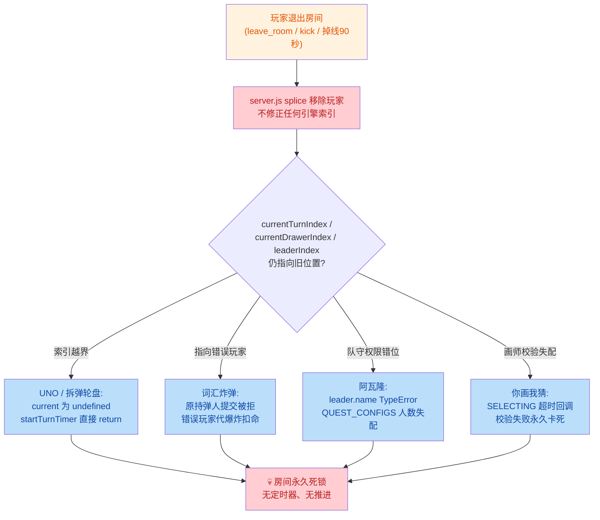
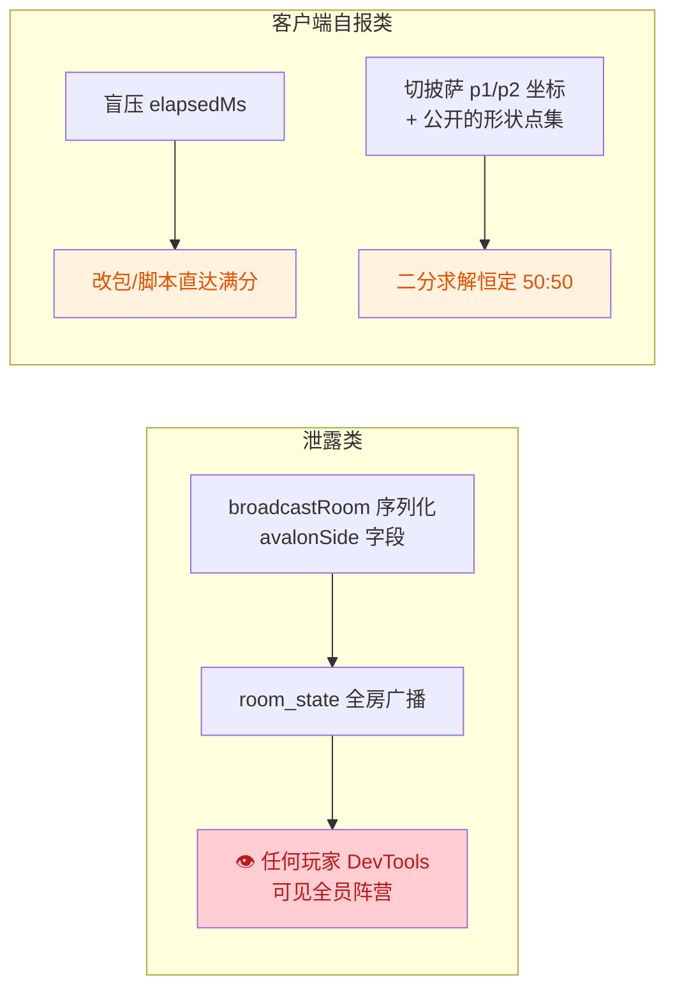
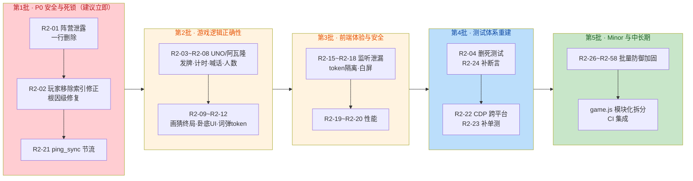

# PartyHub 全面代码审计与修复报告（第二期）

> 审计日期：2026-08-28（第二期）
> 审计对象：server.js（792 行）、12 个游戏引擎 + shuffle 工具（约 3,960 行）、public/game.js（4,191 行）、public/index.html / style.css、tests/（1 个单测文件 + 28 个测试/调试脚本）、package.json / Dockerfile / .dockerignore，合计约 1.5 万行
> 审计方法：4 个并行审计通道（引擎×2 / 前端 / 测试）→ 26 项 Critical/Major 发现交 2 个独立验证子代理逐项复核（引用实际代码行确认）→ `npm test` 实跑确认基线
> 验证结论：**26/26 项存在（0 误报）**；2 项严重度经复核下调（详见各项标注）

---

## 一、第一期审计回顾（全部修复确认在位）

第一期（同日早间）发现并修复的 15 项问题，本期审计逐项复核**全部仍然有效**：

| 第一期编号 | 修复内容 | 本期复核结果 |
|------|----------|--------------|
| #1 | token 换发防会话劫持 | ✅ server.js L179-184 / L219-221 在位 |
| #2 | 5 处 XSS 转义 + showToast 统一转义 | ✅ escapeHtml 覆盖完整（含 & < > " ' 全 5 字符，顺序正确） |
| #3 | join_room 输入校验 + 20 人上限 + draw_stroke 白名单 | ✅ 全部在位 |
| #4 | send_reaction ≤8 字符 | ✅ 在位 |
| #5 | UNO 罚牌吃满规则 | ✅ 在位 |
| #6 | 几A几B 历史私发 | ✅ server.js L271-275 在位 |
| #7 | 16 处 Fisher-Yates 洗牌 | ✅ games/shuffle.js 被各引擎复用 |
| #8 | 阿瓦隆刺客兜底 | ✅ 在位 |
| #9-#15 | 房主移交 / dockerignore / 前端安全求值器 / 设置生效 / node:test / 杂项 | ✅ 全部在位，`npm test` 11/11 通过（103ms） |

---

## 二、本期审计概览

| 指标 | 数值 |
|------|------|
| 本期发现问题总数 | **58 项**（含 1 项已知遗留项现状确认） |
| Critical | 2 项（已全部修复） |
| Major | 23 项（已全部修复） |
| Minor | 33 项（已全部修复） |
| 本期修复进度 | **58/58 全部完成** |
| 双验证确认率 | Critical/Major 26 项 = 2/2 验证者一致确认存在 |
| 验证结果 | 全 JS 语法检查通过 · 单元测试 **23/23 通过**（102ms） · 服务端启动正常 |

**风险分布**：

| 严重度 | 数量 | 编号 |
|--------|------|------|
| Critical | 2 | R2-01 R2-02 |
| Major | 23 | R2-03 ~ R2-25 |
| Minor | 33 | R2-26 ~ R2-58（表格呈现） |

---

## 三、核心风险链路图

**链路 1：玩家退出 → 回合指针失效 → 多游戏死锁（R2-02，本期最高优先）**

**链路 2：信息泄露 / 信任缺失（R2-01、R2-13、R2-14）**

---

## 四、详细问题记录 — Critical（2 项）

### R2-01 【Critical】阿瓦隆阵营字段随 room_state 明文全房广播，全员可作弊

- **位置**：[server.js](file:///d:/code/Antigravity/partyhub/server.js#L103-L113)（safePlayers 序列化，L112）
- **问题**：`broadcastRoom` 把每个玩家的 `avalonSide: p.avalonSide || null` 写进 safePlayers 并通过 `room_state` 广播给房间内**所有**客户端。任何玩家打开浏览器 DevTools 的 Network/WS 面板即可直接看到谁是 good / evil——梅林隐藏、莫甘娜伪装、刺客博弈全部失效。前端 game.js 并未使用该字段（grep 无 `avalonSide`），纯属数据泄露。**2/2 验证者确认 Critical**（验证者引用 avalon.js L90 证实该字段即阵营）。
- **修复建议**：从 safePlayers 中删除 `avalonSide` 一行。若未来需要展示，仅在游戏结束后广播或按玩家私发。
- **验证方法**：两浏览器进同一阿瓦隆房开局，任一玩家 DevTools → Network → WS → room_state 帧，检查 players 数组中不再出现 avalonSide 字段。

### R2-02 【Critical】玩家被移除后回合指针不修正，5 款游戏系统性永久死锁

- **位置**：根因在 [server.js](file:///d:/code/Antigravity/partyhub/server.js#L477-L491)（kick）、[server.js](file:///d:/code/Antigravity/partyhub/server.js#L718-L752)（leave_room）、[server.js](file:///d:/code/Antigravity/partyhub/server.js#L762-L787)（disconnect 90 秒超时）——三处 `splice` 移除玩家后均不调整、不通知引擎的 `currentTurnIndex / currentDrawerIndex / leaderIndex`
- **问题（5 款游戏的具体表现，均经 2/2 验证确认）**：
  1. **UNO**：[uno.js](file:///d:/code/Antigravity/partyhub/games/uno.js#L117-L135) `startTurnTimer` 中 `if (!current) return` 后不设任何定时器，出牌/摸牌入口同样 return → 房间无倒计时、无人能操作，永久冻结。触发例：8 人局 currentTurnIndex=7，players[0] 退房 → 索引越界。
  2. **拆弹轮盘**：[bombRoulette.js](file:///d:/code/Antigravity/partyhub/games/bombRoulette.js#L84-L85) 同型（current undefined → return，interval 永不建立）。
  3. **阿瓦隆**：[avalon.js](file:///d:/code/Antigravity/partyhub/games/avalon.js#L155-L186) leaderIndex 越界后 `leader.name` TypeError（status 已改、timer 未建 → 卡死）；队长被移除但索引指向他人时，60 秒超时回调校验失败 return 同样死锁。
  4. **你画我猜**：[drawGuess.js](file:///d:/code/Antigravity/partyhub/games/drawGuess.js#L152-L166) SELECTING 15 秒超时回调以闭包 `drawer.id` 校验，玩家变动使校验失败 → `clearInterval` 已执行、无后续调度 → 永久停在选词。
  5. **词汇炸弹**：见 R2-12（索引漂移 + 错误玩家代爆炸）。
- **修复建议**：统一方案——在 server.js 三处移除玩家后，调用各引擎的索引修正钩子（`idx % players.length` 归一化，指针指向被删者时前移）；或各引擎在所有指针读取处统一 `% room.players.length` 归一化。一次性修复可同时消除 5 个死锁路径。
- **验证方法**：UNO 8 人局轮到队尾玩家时让 players[0] 点离开，修复后倒计时应继续并轮转到正确玩家（当前实现倒计时消失、全员冻结）。

---

## 五、详细问题记录 — Major（23 项）

### 游戏引擎逻辑（R2-03 ~ R2-14）

| 编号 | 问题 | 位置 | 说明与修复建议 | 验证方法 |
|------|------|------|----------------|----------|
| R2-03 | UNO 发牌无牌量校验，合法配置下开局即死局 | [uno.js](file:///d:/code/Antigravity/partyhub/games/uno.js#L67-L85) | 牌库固定 108 张，`unoHandSize` 允许 1~20、人数 2~8，但发牌不校验 `players × handSize ≤ 108`。6 人×20=120 时 deck 抽空，L77 `deck.pop()` 返回 undefined，L78 `firstCard.color` TypeError（被 safeEngineCall 吞掉）→ 该房间 UNO 永久无法开局。翻底牌 while 循环遇"剩余全是 wild"理论上不退出（概率≈1e-12，理论边界）。**修复**：发牌前钳制 `handSize = min(handSize, floor((deck.length-8)/players.length))`；翻底牌改用 `findIndex` 定位非 wild 牌。注：验证者 A 定 Critical、B 建议 Major，综合取 Major（房间级死局、不崩服务），但需高优先修复 | 设置 unoHandSize=20 后 6 个客户端开局，观察服务端日志 TypeError 与房间卡死；修复后正常开局 |
| R2-04 | 两个"全量测试"脚本协议失配，一个永久挂起一个恒失败 | [test_full_suite.js](file:///d:/code/Antigravity/partyhub/tests/test_full_suite.js#L33-L71)、[test_suite_fast.js](file:///d:/code/Antigravity/partyhub/tests/test_suite_fast.js#L40-L53) | join_room 载荷用 `name/token`（服务端要求 `playerName/playerToken`，类型校验失败静默 return，玩家根本没入房）；事件名全面失配（`word_choices` vs 实际 `select_word_options`、`choose_word` vs `select_word`、`undercover_*` vs `uc_*` 等）。full_suite 首个 await 无超时→永久挂起；suite_fast 等 3 秒必 reject。**修复**：删除两个脚本，或按 test_all_games.js 的正确协议重写并加超时。注：2/2 验证者均建议由 Critical 降为 Major（测试基建失效，非生产缺陷） | `npm start` 后运行 `node tests/test_full_suite.js`，观察进程无限挂起 |
| R2-05 | UNO 摸牌后清除计时器却不重启，挂机即全房死锁 | [uno.js](file:///d:/code/Antigravity/partyhub/games/uno.js#L277-L308) | `drawCardAction` L283 先 clearInterval，但正常摸 1 张分支（非罚牌）只广播+发手牌，不重启 startTurnTimer。玩家摸牌后挂机/掉线进入 90 秒保留期 → 回合永久停滞。**修复**：摸牌分支末尾补 `startTurnTimer(room, io, broadcastRoom)`（15 秒短超时） | 开局后当前玩家点摸牌然后断网：当前无任何推进；修复后 15 秒自动过牌 |
| R2-06 | 喊过 UNO 的玩家出牌后标记被清空，立即可被"抓 UNO"误罚 | [uno.js](file:///d:/code/Antigravity/partyhub/games/uno.js#L173-L178) | L178 出牌后无条件 `hasCalledUno = false`。玩家剩 2 张喊 UNO 后打出倒数第二张（剩 1 张），此刻 L367 catchUno 条件 `hand.length===1 && !hasCalledUno` 立即满足 → 罚 2 张，喊 UNO 零保护。**修复**：改为 `if (current.hand.length !== 1) current.hasCalledUno = false;` | 玩家 A 手牌 2 张喊 UNO 后打出 1 张，玩家 B 立即抓 UNO：当前 A 被罚；修复后无罚 |
| R2-07 | 游戏中途加入的玩家无 hand 属性，被轮到时多处 TypeError | [uno.js](file:///d:/code/Antigravity/partyhub/games/uno.js#L163-L352) | server.js join_room 新玩家只有基础字段（无 hand），且不检查游戏是否进行中。UNO 进行中新玩家加入后被 advanceTurn 轮到：L163 `hand.findIndex`、L243 `hand.some`、L272 `hand.push`、L352 `hand.length` 全部 TypeError，safeEngineCall 吞掉后回合无法推进。**修复**：join_room 对 UNO 进行中的新玩家初始化 `hand: []`（或发牌）；引擎侧入口统一 `if (!current.hand) return;` | UNO 进行中新浏览器加入，等轮次转到新玩家，观察服务端日志 TypeError |
| R2-08 | 阿瓦隆人数中途跌破 5 人后 QUEST_CONFIGS 为 undefined，多处 TypeError 卡死 | [avalon.js](file:///d:/code/Antigravity/partyhub/games/avalon.js#L161-L164) | QUEST_CONFIGS 仅覆盖 5~10 人（开局校验通过后不再检查）。玩家退出使人数降为 4 时：startTeamPropose L163 `config.quests[...]` TypeError（status 已改、timer 已清 → 卡死）；selectTeamMember / submitTeam / tallyQuestVotes 同型。这些调用发生在 timer 回调中**不经 safeEngineCall**，仅靠 uncaughtException 兜底。**修复**：四处取 config 前统一判空，人数不足时结束游戏提示"人数不足" | 5 人阿瓦隆打到组队阶段，1 人退出，等下一次阶段切换：日志 TypeError、全员停在 TEAM_PROPOSE |
| R2-09 | 你画我猜终局 game_over 事件前端无监听，打满轮数无结算界面 | [drawGuess.js](file:///d:/code/Antigravity/partyhub/games/drawGuess.js#L267-L281) | endGame emit 无前缀的 `'game_over'`（含 podium 数据），但 game.js 全文只监听带前缀的 uc_/avalon_/uno_ 等 13 个 `xx_game_over` 事件；room_state 处理器也无 GAME_OVER 分支。打满 maxRounds 后 podium 数据被静默丢弃，玩家看不到任何颁奖界面。**修复**：改为 `dg_game_over` 并前端补监听，或 room_state 处理器补 GAME_OVER 通用结算渲染 | 2 人房打完 3 轮：最后一轮弹窗关闭后无终局界面；修复后出现领奖台 |
| R2-10 | 谁是卧底投票结果 UI 链路三重断裂 | [undercover.js](file:///d:/code/Antigravity/partyhub/games/undercover.js#L299-L353) | ①引擎 emit 的 `uc_vote_result`（含 voteDetails）与 `uc_player_eliminated` 前端无监听；②safePlayers 不含 `votesReceived`；③前端 L1845 消费 `p.votesReceived` 恒 undefined。结果：投票结束后无得票统计、无出局身份卡，核心结算 UI 全部失效。**修复**：任选打通——safePlayers 补 votesReceived / getPublicState 返回票数 / 前端补监听 | 3 人局投出 1 人：玩家卡片永不出现"N票"徽章；修复后正常显示 |
| R2-11 | 几A几B 提交无频率与次数上限，history 全量回传 O(n²) 放大 | [bullsAndCows.js](file:///d:/code/Antigravity/partyhub/games/bullsAndCows.js#L68-L114) | submitGuess 无频控（对比 send_chat 有 500ms 节流）无上限，每次提交把完整 history 数组全量 emit + 全房 broadcastRoom。恶意客户端高频提交造成内存/带宽平方级放大（轻量 DoS 面）。**修复**：server.js 侧加 500ms 频控；引擎侧 history 限长（如 200 条）、bc_guess_result 改增量回传 | 脚本客户端 while 循环 emit，观察进程内存与 WS 发送字节平方增长 |
| R2-12 | 词汇炸弹用数组下标追踪持弹人，退出即漂移 + 中途加入者永远"死亡" | [wordBomb.js](file:///d:/code/Antigravity/partyhub/games/wordBomb.js#L31-L167) | ①玩家退出后 currentTurnIndex 指向错误玩家：原持弹人提交被拒（L95 token 失配）、倒计时归零由错误玩家代爆炸扣命；②中途加入者无 playerLives 条目（仅 startGame 初始化），L162 `> 0` 对 undefined 恒 false → 永远拿不到炸弹，L173 `-= 1` 得 NaN。**修复**：改用 token 记录持弹人（`currentTurnToken` + find）；新玩家入房时补 playerLives | 3 人局让持弹人之前的玩家退出，原持弹人提交合法词被拒；新玩家加入后永远轮不到 |
| R2-13 | 切披萨切线坐标无 [0,1] 范围校验 + 形状点集公开，可二分求解恒定满分 | [perfectSlice.js](file:///d:/code/Antigravity/partyhub/games/perfectSlice.js#L169-L229) | submitSlice 仅校验 Number.isFinite（-1000 也被接受）；形状顶点经 getPublicState L305 与 slice_start_round 公开下发。脚本玩家可对已知多边形二分求精确等分线，diff 稳定 <0.01，每轮固定 150 分。**修复**：p1/p2 加范围校验/钳制（短期）；根治需服务端轨迹校验或接受休闲游戏信任模型并在 README 标注 | 脚本监听 room_state 取 shape.points 二分求切线提交，连续多轮 diff <0.5 得 150 分 |
| R2-14 | 盲压 elapsedMs 完全信任客户端自报（已知遗留项·现状确认） | [holdFive.js](file:///d:/code/Antigravity/partyhub/games/holdFive.js#L61-L95) | 【上期遗留建议第 4 条，本期为现状确认】L66 仅校验 0<elapsedMs≤60000，数值完全信任。控制台直接 emit `targetSeconds*1000` 即恒定满分（精确奖 60 + 满分 100）。**修复**：服务端在 hold_start_round 记录时间锚点，submit 时按服务端时钟差校验（±500ms 容差，兼顾移动端切后台）；或改客户端只报 press/release 信令 | 连上 socket 手动 emit elapsedMs=targetSeconds*1000：当前通过并得 160 分 |

### 前端（R2-15 ~ R2-21）

| 编号 | 问题 | 位置 | 说明与修复建议 | 验证方法 |
|------|------|------|----------------|----------|
| R2-15 | initCanvas 每次入房重复注册 window resize 监听器（累积泄漏） | [game.js](file:///d:/code/Antigravity/partyhub/public/game.js#L1662-L1665) | initCanvas 无条件 `addEventListener('resize', resizeCanvas)`；joined_successfully（L920）每次触发都调用，重连/切后台 N 次后每个 resize 事件执行 N 次（含画布全量重绘）。**修复**：模块级布尔标志保证只注册一次 | 切后台/回前台 5 次，DevTools Console `getEventListeners(window).resize` 数量线性增长 |
| R2-16 | 双开标签页共享 localStorage，token 被后入标签覆盖，刷新后身份错乱 | [game.js](file:///d:/code/Antigravity/partyhub/public/game.js#L888-L891) | 标签 B 携标签 A 的 token 入房被服务端换发新 token 后覆写 localStorage；A 刷新读到 B 的 token，双方争抢席位身份（名字/房主/UNO 手牌互串）。**修复**：token 改 sessionStorage（标签页隔离）或 sessionStorage 优先 + localStorage 兜底 | 标签 A 入房后同浏览器开标签 B 入同房间，再刷新 A：A 身份变为 B 或双方互抢 |
| R2-17 | join_room 失败时用户零反馈 | [game.js](file:///d:/code/Antigravity/partyhub/public/game.js#L862-L879) | 房间满 20 人时服务端只 emit system_message（渲染在不可见的 game-screen 聊天区，且此时用户还在 login-screen）；无 join_error 事件、无按钮禁用。用户点击后毫无反应，极易连点。**修复**：服务端补 `join_error` 事件；前端注册监听 toast 提示；点击后临时禁用按钮 | 20 人房间第 21 个客户端点击进入：界面无任何反应；修复后弹出"房间已满" |
| R2-18 | 7 处裸 localStorage.setItem，隐私模式启动早期白屏 | [game.js](file:///d:/code/Antigravity/partyhub/public/game.js#L9-L50) | L9/L50/L549/L569/L636/L831/L870 无 try-catch（L890/L930 有，风格不一致）。L9 在模块顶层立即执行，Safari 旧版隐私模式抛 QuotaExceededError → 整个 game.js 加载中断白屏。**修复**：封装 safeSetItem 统一替换 9 处 | DevTools → Application 勾选 Block all cookies 刷新：当前白屏 + Uncaught DOMException |
| R2-19 | 切披萨拖动每次 mousemove/touchmove 重设画布尺寸并全量重绘 | [game.js](file:///d:/code/Antigravity/partyhub/public/game.js#L3891-L3937) | 每次 move 都调 initSliceCanvasResolution（canvas.width 赋值清空画布+样式重算）→ drawSliceShape 全量重绘（含大量渐变/阴影/随机 toppings）。60-120 次/秒，低端机掉帧。**修复**：披萨主体预渲染离屏 canvas，拖动仅 drawImage 合成+刀线；尺寸变化才重设 canvas | Performance 面板录制拖动 3 秒：Layout 事件随 move 连续触发；优化后消失 |
| R2-20 | 瞬间数羊奔跑动画用 left 布局属性，多元素每帧强制回流 | [style.css](file:///d:/code/Antigravity/partyhub/public/style.css#L3650-L3670) | `runnerAcrossContainer` 动画 left（-70px → calc(100%+70px)）+ `will-change: left`。left 属布局属性每帧 reflow，多只动物并行（JS 逐帧注入 2.4s）移动端掉帧。**修复**：改 `transform: translateX()` + will-change: transform | Rendering → Layout Shift Regions：当前持续布局闪烁；改 transform 后消失 |
| R2-21 | ping_sync 无频控，任意客户端可全房广播放大 | [server.js](file:///d:/code/Antigravity/partyhub/server.js#L285-L289) | 仅检查房间存在即 broadcastRoom（含 getPublicState 序列化全房广播），无任何节流（对比 send_chat 有 500ms）。单客户端高频 emit = N 倍流量放大 DoS。**修复**：加与 send_chat 相同的按 socket 500ms 节流 | 脚本高频 emit ping_sync，观察 WS 出口流量线性放大 |

### 测试体系（R2-22 ~ R2-25）

| 编号 | 问题 | 位置 | 说明与修复建议 | 验证方法 |
|------|------|------|----------------|----------|
| R2-22 | 16 个 CDP 脚本硬编码 Linux Chromium 路径，Windows 全部不可运行 | [test_cdp_suite.js](file:///d:/code/Antigravity/partyhub/tests/test_cdp_suite.js#L125-L132) 等 16 个文件 | 全部 spawn('/usr/bin/chromium-browser')，本机 Windows 启动即 ENOENT。唯一覆盖全部 12 款游戏+前端 DOM 的两套 CDP 套件与 Bug 回归套件实际覆盖为 0。其中 6 个截图脚本还写 /tmp 无 mkdir。**修复**：浏览器路径抽为候选列表（参考 test_ui_visual_audit.js L30-33 的 Edge/Chrome 写法），输出目录 path.join(__dirname,'screens')+mkdir | `node tests/test_cdp_suite.js` → ENOENT；对照 test_ui_visual_audit.js 可正常运行 |
| R2-23 | 单元测试覆盖率约 1.9%：server.js 与 9/12 引擎 0 单测 | [engine_core.test.js](file:///d:/code/Antigravity/partyhub/tests/unit/engine_core.test.js) | npm test 仅 11 个纯函数用例（shuffle/math24 安全求值/uno.isPlayable/bc.evaluateGuess），直接覆盖约 167 行 / 全项目 8,946 核心行 ≈1.9%。server.js 792 行（席位认领/防顶号/房主移交/踢人/白名单/断线宽限）0 单测；avalon/undercover/drawGuess/flashCounter/perfectSlice/cubeCount/wordBomb/bombRoulette/holdFive 共 9 引擎 0 单测；引擎状态机函数（initRoomState/startGame/submit*）全部无测试——引擎组本轮发现的多数缺陷正因如此漏网。**修复**：优先补 server.js 席位/房主单测（可导出纯函数化）；每引擎最小 fake-io 状态机测试（`{to(){return{emit(){}}}}` 注入） | `npx c8 node --test tests/unit/` 量化行覆盖率（预计 <2%） |
| R2-24 | 5 个可用 E2E 脚本弱断言/零断言 + 恒 exit(0)，CI 无法感知失败 | [test_all_games.js](file:///d:/code/Antigravity/partyhub/tests/test_all_games.js#L82-L285)、[test_new_games.js](file:///d:/code/Antigravity/partyhub/tests/test_new_games.js#L129-L242)、[test_perfect_slice.js](file:///d:/code/Antigravity/partyhub/tests/test_perfect_slice.js#L17-L79)、[test_reclaim.js](file:///d:/code/Antigravity/partyhub/tests/test_reclaim.js#L52-L59) | 失败仅 console.error 不计数，结尾无条件"全部通过"+exit(0)；perfect_slice 全文 0 断言（null 也打 ✓）；reclaim 有判定不影响退出码。**修复**：失败计数+断言+exitCode=1；e2e 脚本内自行 spawn server.js 并 finally 杀掉，加 `test:e2e` npm script | 服务健康时人为破坏一个断言前提，脚本仍 exit(0) |
| R2-25 | 部分 CDP 脚本失败路径不清理浏览器进程（范围已修正） | [test_historical_bugs_cdp.js](file:///d:/code/Antigravity/partyhub/tests/test_historical_bugs_cdp.js#L331-L338)、[test_cube_cdp_round2.js](file:///d:/code/Antigravity/partyhub/tests/test_cube_cdp_round2.js#L256-L262) | chromeProc.kill() 仅在成功路径；catch 分支 exit(1) 前不 kill 不关 ws → 每次失败泄漏一个无头 Chromium。注：test_cdp_suite / test_all_12_games_cdp / test_ui_visual_audit 已有 finally 保护（验证者 B 修正了笼统表述）。**修复**：统一 try/finally kill 全部进程与 ws | 断言前人为 throw，任务管理器观察残留 chromium 进程 |

---

## 六、Minor 问题汇总（33 项，按域分组）

### 引擎侧（16 项）

| 编号 | 问题 | 位置 | 建议 | 验证方法 |
|------|------|------|------|----------|
| R2-26 | catchUno 未校验 catcher 存在性与游戏状态 | [uno.js](file:///d:/code/Antigravity/partyhub/games/uno.js#L363-L373) | 补 `if (!catcher \|\| room.status !== 'UNO_PLAYING') return;` | F12 emit uno_catch_uno 带无效 token，观察日志 TypeError |
| R2-27 | callUno 无状态校验，LOBBY 阶段 hand 未定义崩溃 | [uno.js](file:///d:/code/Antigravity/partyhub/games/uno.js#L347-L352) | 补状态与 hand 判空 | 大厅阶段 emit uno_call_uno 观察日志 |
| R2-28 | uno_card_played / uno_called 事件前端无监听（死契约） | [uno.js](file:///d:/code/Antigravity/partyhub/games/uno.js#L189-L196) | 前端补监听做出牌动画，或删引擎冗余 emit | grep game.js 无这两个事件名 |
| R2-29 | 阿瓦隆中途加入玩家无阵营却可被选入队投 FAIL | [avalon.js](file:///d:/code/Antigravity/partyhub/games/avalon.js#L189-L205) | selectTeamMember 校验 avalonRole；无 side 玩家投票按 good 或拒绝 | 组队阶段新玩家入房被选入队可投失败 |
| R2-30 | avalon_team_vote_result / avalon_quest_result 前端无监听 | [avalon.js](file:///d:/code/Antigravity/partyhub/games/avalon.js#L342-L347) | 前端补监听弹出投票/任务结果面板 | 组队表决完成无赞成/反对明细 |
| R2-31 | selectTeamMember 不校验 token 可塞幽灵队员 | [avalon.js](file:///d:/code/Antigravity/partyhub/games/avalon.js#L196-L203) | push 前校验 token 在房内 | F12 emit 假 token，selectedTeam 出现无效项 |
| R2-32 | update_room_settings 数值无范围校验（spyCount 可 0/负，秒结局） | [server.js](file:///d:/code/Antigravity/partyhub/server.js#L354-L365) | 白名单加每字段 min/max 表；引擎侧 clamp | 设 spyCount=-1 开局，第一轮淘汰即判卧底全灭 |
| R2-33 | 断线重连补发仅覆盖 2 款游戏：卧底词/阿瓦隆身份/UNO手牌/数羊/数方块丢失 | [server.js](file:///d:/code/Antigravity/partyhub/server.js#L265-L275) | join_room 按 gameType 补发私有身份（私发） | 卧底发言阶段刷新页面：底牌卡片为空 |
| R2-34 | selectWord 不校验词在候选白名单内 | [drawGuess.js](file:///d:/code/Antigravity/partyhub/games/drawGuess.js#L164-L171) | 补 `wordOptions.includes` 校验 | F12 emit select_word {word:123}，后续 room_state 缺字段 |
| R2-35 | 画师轮换以动态人数判定，中途进出使轮次语义错乱 | [drawGuess.js](file:///d:/code/Antigravity/partyhub/games/drawGuess.js#L117-L120) | 开局冻结 painterOrder 快照遍历 | 3 人第 1 轮中途第 4 人加入：该轮变 4 人画 |
| R2-36 | 词弹幸存者快照陈旧 + 全员淘汰时刚爆炸者被判胜 +200 | [wordBomb.js](file:///d:/code/Antigravity/partyhub/games/wordBomb.js#L181-L198) | alivePlayers 移入回调实时求值；0 幸存者 endGame(room, null) 平局 | 单人残局耗尽生命：自己"淘汰并获胜" |
| R2-37 | 词库加载失败时校验降级，任意垃圾串可得分 | [wordBomb.js](file:///d:/code/Antigravity/partyhub/games/wordBomb.js#L122-L129) | 去掉 `size > 0` 条件让空词库走中文兜底 | 重命名词库后启动，提交'天abcdefgh'判对 |
| R2-38 | 爆炸后 baseTime 硬编码 7.5 覆盖房主 wbTime 配置 | [wordBomb.js](file:///d:/code/Antigravity/partyhub/games/wordBomb.js#L191-L191) | 保存原始配置续爆复用 | wbTime=30 触发爆炸后新炸弹 7 秒 |
| R2-39 | 数方块兜底分支 totalCubes 与 grid 实际数不一致（<0.1% 概率整轮不可玩） | [cubeCount.js](file:///d:/code/Antigravity/partyhub/games/cubeCount.js#L27-L33) | 兜底重建网格后重求和 | 单测 mock Math.random 构造触发条件 |
| R2-40 | 4 引擎 submit 入口不校验玩家在房，被踢者可幽灵提交+触发全房广播 | [cubeCount.js](file:///d:/code/Antigravity/partyhub/games/cubeCount.js#L148-L169) | 统一补 players.find 判空；kick 后调用 socket.leave | 踢人后继续 emit cube_submit_answer，answeredTokens 增长 |
| R2-41 | parseInt 宽松解析且不校验选项在合法集内 | [cubeCount.js](file:///d:/code/Antigravity/partyhub/games/cubeCount.js#L153-L153) | 改 Number + options.includes 校验 | 提交 '6abc' 答案为 6 时判对 |
| R2-42 | holdFive/wordBomb 计时器清理与 gameType 守卫防御不一致 | [holdFive.js](file:///d:/code/Antigravity/partyhub/games/holdFive.js#L15-L59) | startGame 补双计时器清理+守卫（对齐 math24 模式） | 代码走查对照 |

### 前端侧（9 项）

| 编号 | 问题 | 位置 | 建议 | 验证方法 |
|------|------|------|------|----------|
| R2-43 | kicked/退出后本地状态残留（聊天记录/私密角色/URL参数） | [game.js](file:///d:/code/Antigravity/partyhub/public/game.js#L925-L934) | 抽 resetRoomLocalState() 统一清理两处调用 | 房 A 聊天后被踢加入房 B：旧消息残留 |
| R2-44 | 双重转义显示 bug（escapeHtml 后经 textContent 渲染显示 &lt; 实体） | [game.js](file:///d:/code/Antigravity/partyhub/public/game.js#L2225-L2227) | textContent 路径传原始字符串，移除 4 处预转义 | 昵称 "a<b&c" 打完 UNO：结算标题出现 '&amp;' |
| R2-45 | 多处服务端字段 innerHTML 插值未转义（纵深防御缺失，当前有服务端校验兜底） | [game.js](file:///d:/code/Antigravity/partyhub/public/game.js#L1782-L1784) | 统一模板插值包 escapeHtml（尤其 h.guess 用户回显） | grep innerHTML 模板中未转义插值 |
| R2-46 | 全局心跳 setInterval 永不清 + flashAnimationId 死代码 | [game.js](file:///d:/code/Antigravity/partyhub/public/game.js#L1009-L1014) | 离房 clearInterval 或注释说明；删 flashAnimationId | 退出房间后心跳回调仍执行 |
| R2-47 | 开局/准备按钮无防抖，双击 ready 翻转两次 | [game.js](file:///d:/code/Antigravity/partyhub/public/game.js#L1220-L1230) | 300ms 防抖或 room_state 回流前锁定 | 快速双击准备按钮观察状态抖动 |
| R2-48 | 无 socket disconnect 处理器，断线期间界面无提示 | [game.js](file:///d:/code/Antigravity/partyhub/public/game.js#L978-L1006) | 补 disconnect 监听显示"重连中"横幅 | 停止 Node 服务：界面静止无感知 |
| R2-49 | 初始 token 用 Math.random（非加密安全）+ 废弃 substr | [game.js](file:///d:/code/Antigravity/partyhub/public/game.js#L49-L50) | 改 crypto.randomUUID()；substr→slice（已有服务端顶号防护缓解） | 代码审查 |
| R2-50 | 单文件 4190 行、80+ 全局变量、stageMap 等重复定义两份 | [game.js](file:///d:/code/Antigravity/partyhub/public/game.js) | 渐进拆分：先抽公共常量，再按游戏拆 12 模块 | grep stageMap 出现两处定义 |
| R2-51 | viewport 禁用缩放违反 WCAG 1.4.4 | [index.html](file:///d:/code/Antigravity/partyhub/public/index.html#L5-L5) | 用 touch-action: manipulation 替代 | 移动端双指无法放大 |

### 测试侧（8 项）

| 编号 | 问题 | 位置 | 建议 | 验证方法 |
|------|------|------|------|----------|
| R2-52 | test_logic.js 复制业务逻辑的沙盒推演，防回归价值 0 + 死导入 | [test_logic.js](file:///d:/code/Antigravity/partyhub/tests/test_logic.js#L1-L31) | 删除或改为直接单测 server 导出函数 | 改 server.js 认领逻辑后此脚本仍"通过" |
| R2-53 | 死导入：test_switch_app 的 fs、test_ui_visual_audit 的 execSync | [test_switch_app.js](file:///d:/code/Antigravity/partyhub/tests/test_switch_app.js#L4-L4) | 删除两处 | grep 无使用点 |
| R2-54 | 被测地址硬编码 + 服务未起时静默挂起后仍"通过" | [test_perfect_slice.js](file:///d:/code/Antigravity/partyhub/tests/test_perfect_slice.js#L3-L3) | env 变量 + connect_error 快速失败 | 不起服务运行：数十秒后仍 exit(0) |
| R2-55 | test_reclaim 固定房间号/token，90 秒内重跑互相干扰 | [test_reclaim.js](file:///d:/code/Antigravity/partyhub/tests/test_reclaim.js#L7-L23) | 加时间戳后缀 | 间隔 <90s 连跑两次结果不同 |
| R2-56 | 固定睡眠驱动（wait 8500 等）而非事件驱动，慢且 flaky | [test_all_games.js](file:///d:/code/Antigravity/partyhub/tests/test_all_games.js#L122-L143) | 改 socket.once + withTimeout | 缩短 wait 复现假失败 |
| R2-57 | CDP 套件存在"伪造通过"（直接赋值内部变量打 ✓）与无条件 PASS | [test_cdp_suite.js](file:///d:/code/Antigravity/partyhub/tests/test_cdp_suite.js#L341-L345) | 改真实 UI 点击 + throw 型断言 | 读代码：PASS 与断言无对应关系 |
| R2-58 | ui_audit_report.json/md 运行产物入库（8831 行）+ 2 对克隆脚本 + ws 未声明依赖（验证者降级：Minor） | [tests/](file:///d:/code/Antigravity/partyhub/tests)、[package.json](file:///d:/code/Antigravity/partyhub/package.json) | 报告产物入 .gitignore；删克隆脚本（cdp_suite/full_suite）；devDependencies 补 ws | git ls-files 含报告文件；npm ls ws 显示 hoisted |

---

## 七、测试覆盖率客观评估

**基准**：核心 JS 约 8,946 行（server.js 792 + public/game.js 4,191 + games/ 3,962）

| 模块 | 行数 | 单测覆盖 | 覆盖率 |
|---|---|---|---|
| games/shuffle.js | 15 | 15 | 100% |
| games/math24.js | 365 | ~113 | ~31%（仅纯函数） |
| games/bullsAndCows.js | 164 | 12 | ~7% |
| games/uno.js | 446 | 19 | ~4% |
| server.js | 792 | 0 | **0%** |
| avalon / undercover / drawGuess / flashCounter / perfectSlice / cubeCount / wordBomb / bombRoulette / holdFive | 3,192 | 0 | **0%** |
| public/game.js | 4,191 | 0（仅被本机不可运行的 CDP 脚本间接触碰） | **0%** |

**E2E 可用性**：当前 Windows 机器可运行的 socket 级脚本覆盖 12 款中 11 款的 happy-path（hold-five 可用覆盖 0）；触达 server.js 39 个事件入口中约 23 个（~59%），未触达 16 个（update_room_settings / transfer_host / kick_player / draw_stroke / leave_room 等）；除 test_cube_round2.js 外全部弱断言/零断言。**结论：项目唯一可信的自动化门禁是 11 个纯函数单测（约 1.9% 覆盖）**——本期引擎侧多数逻辑缺陷正因状态机零测试而漏网。

---

## 八、修复优先级与解决批次（建议路线图）

> 按依赖关系与风险收敛顺序分 5 批；每批完成后运行 `npm test` + 对应验证方法回归。建议按批次推进而非按严重度单独摘取（R2-02 一项修复可同时消除 5 个死锁表现）。

**逐批范围与验收**：

| 批次 | 包含编号 | 验收标准 |
|------|----------|----------|
| 第1批 P0 | R2-01、R2-02、R2-21 | room_state 无 avalonSide；5 款游戏在玩家退出后均能继续推进；ping_sync 高频触发被节流 |
| 第2批 | R2-03 ~ R2-12、R2-14 | 每项的"验证方法"列逐一通过；重点：6人×20手牌正常开局、摸牌后有倒计时、卧底投票显示票数 |
| 第3批 | R2-13、R2-15 ~ R2-20 | resize 监听器恒为 1；隐私模式不白屏；切披萨拖动无 Layout 抖动 |
| 第4批 | R2-04、R2-22 ~ R2-25 | npm test 扩容后全绿；CDP 套件在 Windows 可运行；E2E 失败时 exit(1) |
| 第5批 | R2-26 ~ R2-58 | 按表格验证方法逐项消化；game.js 拆分可单独排期 |

---

## 九、遗留与长期建议（不阻塞本期）

1. **CI 集成**（上期遗留仍有效）：GitHub Actions push 时自动 `npm test`，第 4 批完成后可加 `test:e2e`。
2. **信任模型声明**：R2-13/R2-14 若产品定位为熟人聚会暂不修复，建议 README 明确标注"防君子不防脚本"。
3. **前端模块化**：R2-50 是 4,190 行单文件的长线债务，建议按第 5 批单独规划（拆分有回归风险，需先补前端测试）。
4. **CORS 收紧**（上期遗留仍有效）：公网固定域名部署时配置 `CORS_ORIGIN`。
5. **进程守护**（上期遗留仍有效）：uncaughtException 拦截保活需配合 Docker restart 策略择机重启。

---

## 十、审计方法与验证记录

| 验证项 | 方式 | 结果 |
|--------|------|------|
| 审计通道 | 4 个并行子代理（引擎A/引擎B/前端/测试）逐行阅读全部核心代码 | 完整覆盖 15 文件约 1.5 万行 |
| 交叉验证 | 2 个独立验证子代理对 26 项 Critical/Major 逐项读码复核 | 26/26 存在（0 误报）；2 项严重度下调（R2-04 Critical→Major、R2-03 Critical→Major）；1 项范围修正（R2-25） |
| 排除的疑点 | math24 全部 15 题穷举验证有解；holdFive targetSeconds 公开属设计意图；escapeHtml 5 字符覆盖正确；定时器挂载 room.timer/roundTimeout 体系健康；连点幂等防护达标 | 均有实证，未列入问题 |
| 单元测试基线 | `npm test` 实跑 | 11/11 通过（103ms） |
| 第一期修复回归 | 逐项代码定位 | 15/15 修复在位 |

*本报告由代码审计流程自动生成；所有问题均附验证方法与修复建议，待用户确认修复范围后按批次执行。*
